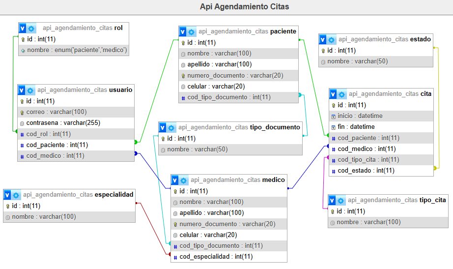
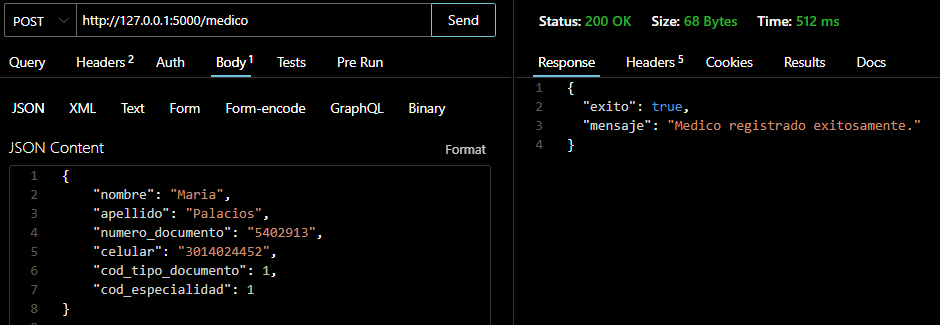
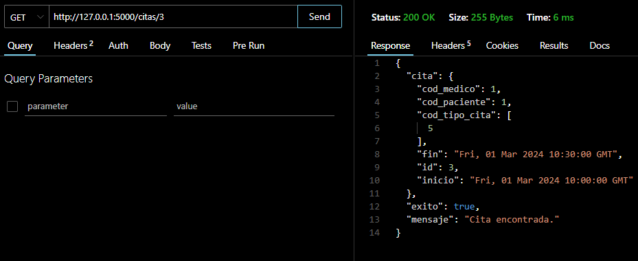
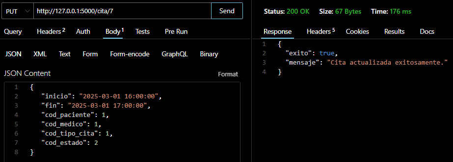
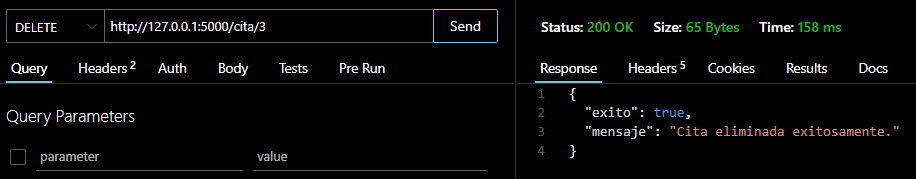

# 📌 API de Agendamiento de Citas  

## 🚀 Instalación  

### 1️⃣ Clonar el repositorio  
```bash
git clone https://github.com/Nico-Guz/API-REST-Agendamiento-Citas.git
cd API-REST-Agendamiento-Citas
```

### 2️⃣ Crear un entorno virtual (opcional pero recomendado)  
```bash
# En Linux/macOS
python3 -m venv venv  
source venv/bin/activate  

# En Windows
python -m venv venv  
venv\Scripts\activate
```

### 3️⃣ Instalar dependencias  
Ejecuta el siguiente comando para instalar las librerías necesarias:  
```bash
pip install -r requirements.txt
```
Si aún no has creado `requirements.txt`, guárdalo con este contenido:  
```
alembic==1.14.1
blinker==1.9.0
click==8.1.8
colorama==0.4.6
Flask==3.1.0
Flask-Migrate==4.1.0
Flask-MySQLdb==2.0.0
Flask-SQLAlchemy==3.1.1
greenlet==3.1.1
itsdangerous==2.2.0
Jinja2==3.1.5
Mako==1.3.9
MarkupSafe==3.0.2
mysqlclient==2.2.7
python-dotenv==1.0.1
SQLAlchemy==2.0.38
typing_extensions==4.12.2
Werkzeug==3.1.3
```


## 🔧 Configuración  

Crea un archivo `.env` en la raíz del proyecto y define las variables de conexión a la base de datos:  
```env
MYSQL_HOST=localhost
MYSQL_USER=root
MYSQL_PASSWORD=
MYSQL_DB=api_agendamiento_citas
```


## ▶️ Ejecución  

Para iniciar la API, usa:  
```bash
python app.py
```
Por defecto, se ejecutará en **http://127.0.0.1:5000**.  


## 📊 Modelo de Datos
El siguiente diagrama representa la estructura de la base de datos normalizada utilizada en el proyecto:


En este modelo se incluyen las siguientes entidades principales:
- Pacientes: Almacena la información de los pacientes registrados.
- Médicos: Contiene los datos de los médicos y sus especialidades.
- Citas: Registra las citas médicas, incluyendo fechas y estados.
  
Las relaciones entre estas entidades permiten gestionar eficientemente el agendamiento de citas.


## 📌 Funcionalidades implementadas  
✅ Configuración del entorno con Flask y MySQL.  
✅ Registro de pacientes, incluyendo sus datos personales y credenciales de usuario.  
✅ Registro, actualización y eliminación de citas médicas.  
✅ Registro de médicos con su especialidad y datos personales.  
✅ Ruta principal con un formulario de inicio de sesión.  


## 📍 Rutas disponibles  

### 🔹 **Pacientes**  

#### ➕ **Registrar un paciente**  
Registra un paciente junto con sus credenciales.  

- **URL**: `/paciente`  
- **Método**: `POST`  
- **Formato de solicitud (JSON) y Respuesta exitosa**:  


---

### 🔹 **Médicos**  

#### ➕ **Registrar un médico**  
Registra un nuevo médico en la base de datos.  

- **URL**: `/medico`  
- **Método**: `POST`  
- **Formato de solicitud (JSON) y Respuesta exitosa**:  
 
- **Respuesta en caso de error**:  
```json
{
  "mensaje": "Error en el registro: <detalle_del_error>",
  "exito": false
}
```

---

### 🔹 **Citas**  

#### 📋 **Listar todas las citas**  
- **URL**: `/citas`  
- **Método**: `GET`  
- **Respuesta exitosa**:  
 

#### 🔍 **Obtener una cita específica**  
- **URL**: `/citas/<codigo>`  
- **Método**: `GET`  
- **Respuesta exitosa**:  
 

#### ➕ **Registrar una nueva cita**  
- **URL**: `/cita`  
- **Método**: `POST`  
- **Formato de solicitud (JSON) y Respuesta exitosa**:  
 

#### ✏️ **Actualizar una cita**  
- **URL**: `/cita/<codigo>`  
- **Método**: `PUT`  
- **Formato de solicitud (JSON) y Respuesta exitosa**:  
 

#### ❌ **Eliminar una cita**  
- **URL**: `/cita/<codigo>`  
- **Método**: `DELETE`  
- **Respuesta exitosa**:  

